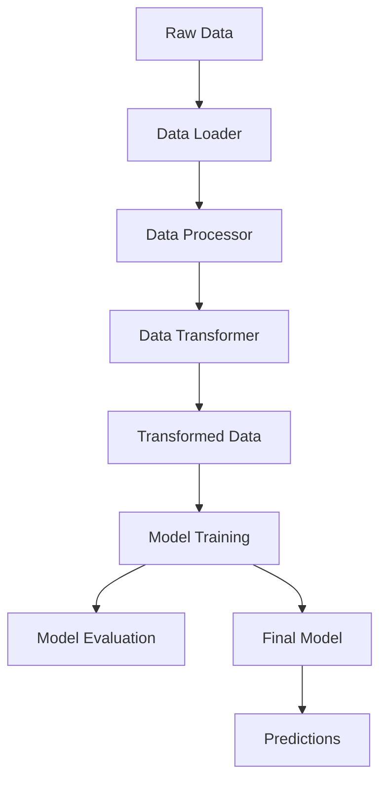

# 🚀 Lead Scoring ML Project

<div align="center">


</div>

> Predict the likelihood of leads converting to internet plan customers using advanced machine learning techniques and SOLID architecture.

## 📋 Overview

This project implements a modular and extensible machine learning pipeline for lead scoring. It processes raw data, performs feature engineering, trains multiple classification models with hyperparameter tuning, and provides actionable predictions to help prioritize leads with higher conversion potential.

## 🏗️ Architecture

The project follows SOLID principles and uses object-oriented design patterns:

- **Abstraction**: Abstract interfaces for data handling and model implementation
- **Encapsulation**: Proper encapsulation of functionality within classes
- **Inheritance**: Class hierarchies for reusable functionality
- **Polymorphism**: Interchangeable components with common interfaces

<div align="center">



</div>

## 🗂️ Project Structure

```
.
├── data/                      # Data directory
│   ├── raw/                  # Raw data files
│   └── processed/            # Processed data files
├── models/                   # Trained models
├── notebooks/                # Jupyter notebooks
├── src/                      # Source code
│   ├── data/                # Data processing modules
│   │   ├── loader.py        # Data loading
│   │   ├── processor.py     # Data processing
│   │   ├── transformer.py   # Feature transformation
│   │   ├── validator.py     # Data validation
│   │   └── pipeline.py      # Data pipeline
│   ├── models/              # Model implementations
│   │   ├── base.py          # Base model interface
│   │   ├── random_forest.py
│   │   ├── xgboost.py
│   │   ├── logistic_regression.py
│   │   └── factory.py       # Model factory
│   ├── config.py            # Configuration
│   ├── train.py             # Training module
│   └── predict.py           # Prediction module
├── tests/                    # Test files
├── requirements.txt          # Dependencies
└── README.md                # Documentation
```

## 🚀 Quick Start

### Installation

1. Clone the repository:
```bash
git clone <repository-url>
cd lead-scoring-ml
```

2. Create a virtual environment:
```bash
python -m venv venv
source venv/bin/activate  # On Windows: venv\Scripts\activate
```

3. Install dependencies:
```bash
pip install -r requirements.txt
```

### Data Flow

1. Raw data (`data/raw/data_ptd.csv`) is processed and cleaned
2. Processed data is saved to `data/processed/data_aed.csv`
3. Final transformed data is saved to `data/processed/data.csv`
4. Models are trained on the final data
5. Trained models are saved to `models/trained/`

## 📊 Usage Examples

### Processing Data

```python
from src.data.pipeline import run_data_pipeline

# Process data from raw to final format
result = run_data_pipeline()
print(f"Processed data shape: {result['data'].shape}")
```

### Training Models

```python
from src.train import train_model

# Train a Random Forest model with hyperparameter tuning
rf_results = train_model('random_forest')
print(f"Random Forest ROC AUC: {rf_results['test_metrics']['roc_auc']:.4f}")

# Train XGBoost model
xgb_results = train_model('xgboost')
print(f"XGBoost ROC AUC: {xgb_results['test_metrics']['roc_auc']:.4f}")
```

### Making Predictions

```python
from src.predict import predict
from pathlib import Path

# Get probability predictions for new leads
predictions = predict(
    data=Path("data/raw/new_leads.csv"),
    model_type="random_forest",
    return_proba=True
)

# Print top 5 leads with highest conversion probability
top_leads = predictions.sort_values(by='prob_1', ascending=False).head()
print("Top leads for follow-up:")
print(top_leads)
```

## 🧠 ML Models

| Model | Description | Hyperparameter Tuning |
|-------|-------------|----------------------|
| **Random Forest** | Ensemble method using multiple decision trees | GridSearchCV with cross-validation |
| **XGBoost** | Gradient boosting implementation optimized for speed and performance | GridSearchCV with cross-validation |
| **Logistic Regression** | Linear model for classification | GridSearchCV with cross-validation |

## 🛠️ Development

### Code Style

The project follows PEP 8 guidelines. To check and format code:

```bash
# Check code style
flake8 src/

# Format code
black src/

# Check types
mypy src/
```

### Testing

Run tests with pytest:

```bash
pytest tests/
```

## 📈 Performance Metrics

Example performance metrics from model evaluation:

| Model | Accuracy | Precision | Recall | F1-Score | ROC AUC |
|-------|----------|-----------|--------|----------|---------|
| Random Forest | 0.6516 | 0.6947 | 0.6886 | 0.6916 | 0.7100 |
| SVM | 0.6360 | 0.6593 | 0.6352 | 0.6470 | 0.4400 |
| Gaussian Naive Bayes | 0.6666 | 0.6352 | 0.6352 | 0.6352 | 0.6300 |

O Random Forest Classifier apresentou o melhor desempenho geral, com:
- Maior ROC AUC (0.71)
- Melhor F1-Score (0.6916)
- Melhor balanceamento entre precisão e recall
- Boa capacidade de generalização

## ✨ Features

- **Modular Design**: Components can be easily extended or replaced
- **Hyperparameter Tuning**: Automatic optimization of model parameters
- **Data Validation**: Validation at each stage of processing
- **Factory Pattern**: Easy creation of different components
- **Type Hints**: Comprehensive type annotations for better tooling
- **Logging**: Detailed logging throughout the pipeline

## 📄 License

This project is licensed under the MIT License. See the LICENSE file for details.

---

<div align="center">
  <p>
    <a href="https://github.com/adrianofonseca1000">Made with ❤️</a>
  </p>
</div>